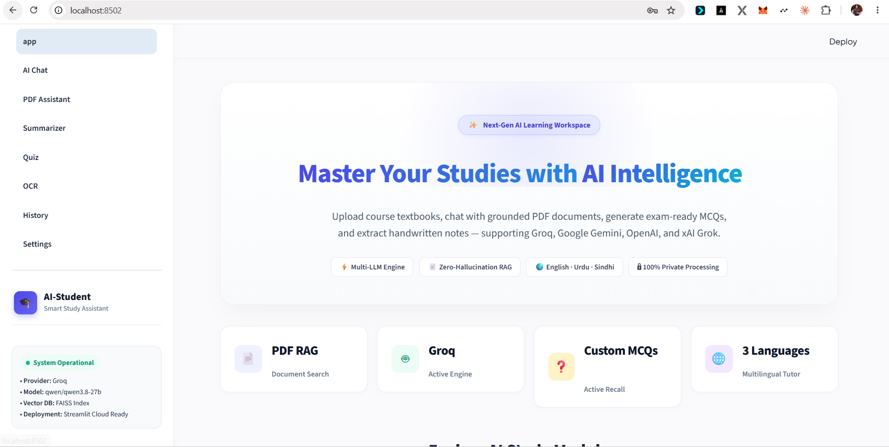
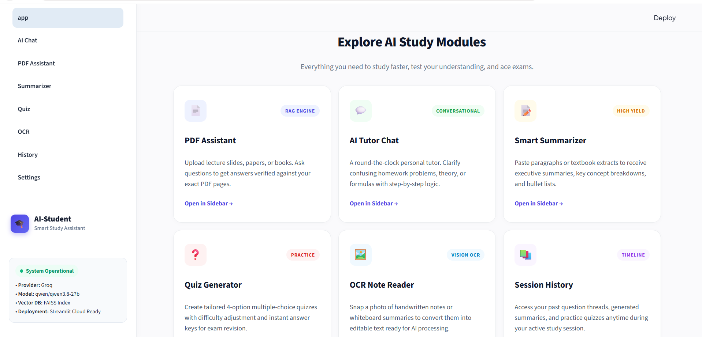
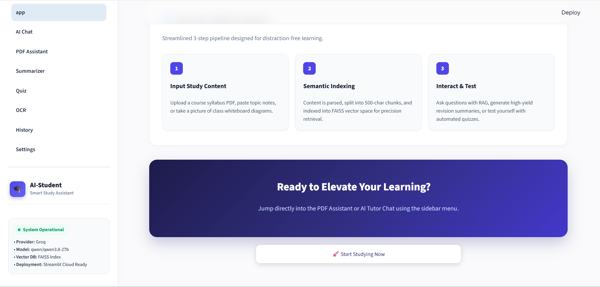
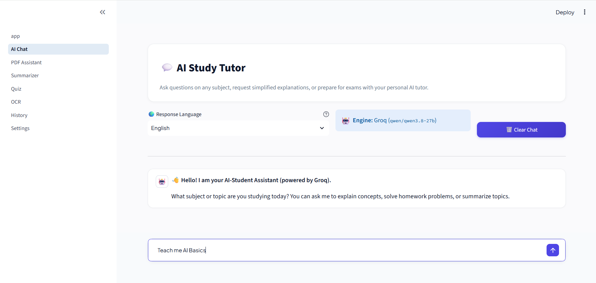
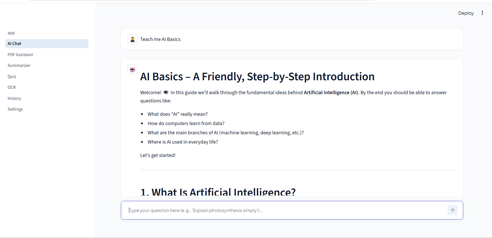
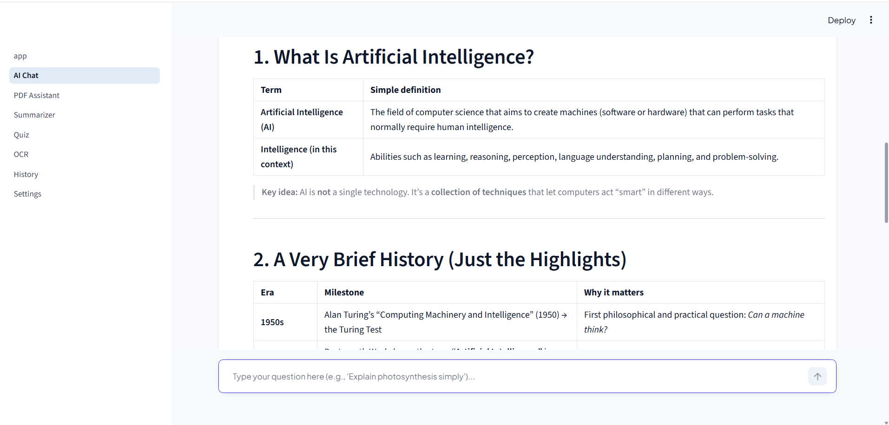
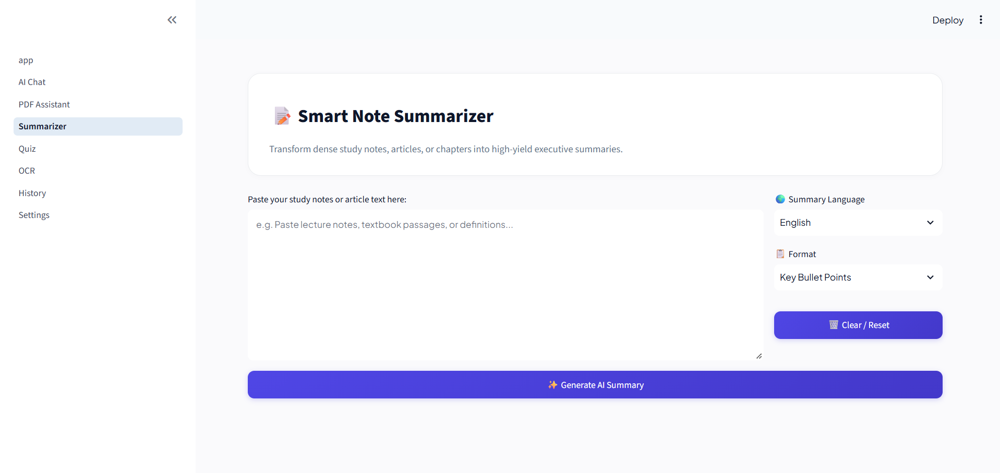
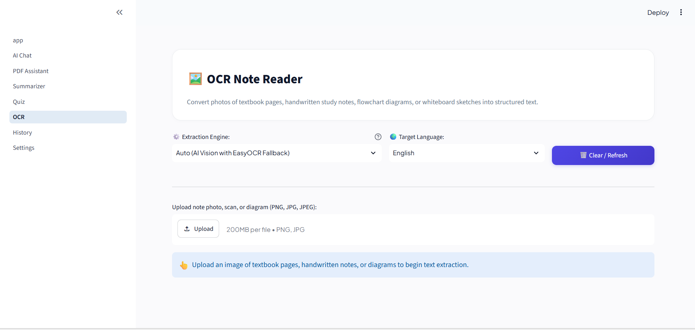
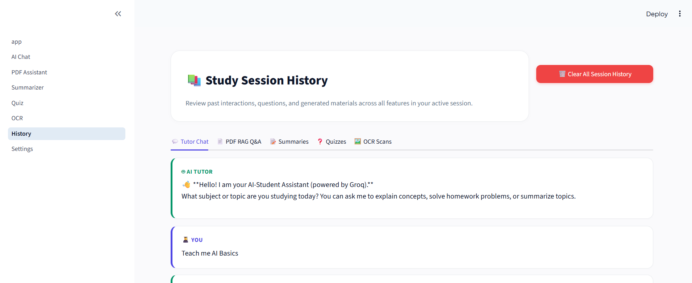
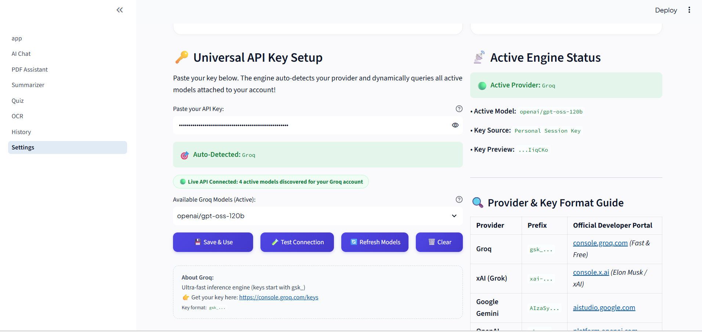

# 🎓 AI-Student Assistant

<div align="center">


**An intelligent, multi-provider AI learning workspace engineered for university students and educators.**  
*Chat with an AI Tutor · Grounded Textbook RAG Q&A · High-Yield Summaries · Exam Quiz Generator · Hybrid Vision/EasyOCR · Universal Key Auto-Detection*

[Explore Screenshots](#-application-walkthrough--screenshots) · [Quickstart](#-quickstart-guide) · [Architecture](#-how-the-rag-pipeline-works) · [Tech Stack](#-tech-stack)

</div>

---

## 🌟 Overview

**AI-Student Assistant** is a modern, high-contrast, responsive study platform that turns course textbooks, lecture slides, and handwritten notes into an interactive learning environment. Built on Streamlit with a clean SaaS aesthetic, it connects to **four premier AI model providers** (Groq, xAI Grok, Google Gemini, and OpenAI) and features a zero-hallucination **RAG (Retrieval-Augmented Generation)** knowledge pipeline backed by FAISS vector search.

Whether studying in **English, Urdu, or Sindhi**, students can ask deep questions, generate practice multiple-choice exams, condense complex chapters, and digitize whiteboard diagrams effortlessly.

---

## 🖼️ Application Walkthrough & Screenshots

### 1. Modern SaaS Landing View
*A clean, distraction-free landing page introducing the platform, core feature modules, and 3-step learning pipeline.*

| Platform Hero & Overview | Feature Cards Grid |
|---|---|
|  |  |

| 3-Step Study Workflow & Call to Action |
|:---:|
|  |

---

### 2. 💬 AI Study Tutor (Trilingual Chat)
*Conversational study companion supporting English, Urdu, and Sindhi. Maintains multi-turn conversation history across navigation with one-click clear.*

| Tutor Overview & Controls | Interactive Multi-Turn Dialogue |
|---|---|
|  |  |

| Detailed Academic Explanations |
|:---:|
|  |

---

### 3. 📄 Document Assistant (RAG Pipeline)
*Upload any course PDF syllabus, textbook chapter, or research paper. The system splits, embeds, and indexes text into a FAISS vector space. Students can ask consecutive questions in a persistent Q&A thread and inspect the exact source passages retrieved.*

| Document Upload & Semantic Indexing | Grounded Q&A Thread with Source Inspection |
|---|---|
|  |  |

---

### 4. 📝 Smart Note Summarizer & ❓ Quiz Generator
*Condense dense lecture notes into executive takeaways or create 10-question practice quizzes with answer keys and rationale.*

| 📝 High-Yield Note Summarizer | ❓ Practice MCQ Quiz Generator |
|---|---|
|  |  |

---

### 5. 🖼️ Hybrid OCR Note Reader & 📚 Session History
*Transcribe photos of textbook pages, handwritten notes, and flowchart diagrams using either **Smart AI Vision** or **Local Offline EasyOCR**.*

| 🖼️ Hybrid Vision & EasyOCR Reader | 📚 Unified Study Session Timeline |
|---|---|
|  |  |

---

### 6. ⚙️ Universal Multi-Provider API & Model Settings
*Paste your API key (`gsk_...`, `xai-...`, `AIza...`, or `sk-...`). The system auto-detects the provider, directly queries the `/models` endpoint to discover active models on your account, and filters out decommissioned models automatically.*

| Universal API Key Auto-Detection & Live Model Discovery |
|:---:|
|  |

---

## ✨ Feature Breakdown

| Feature Module | Key Capabilities |
|---|---|
| 💬 **AI Study Tutor** | Multi-turn pedagogical chat with response language selector (**English**, **Urdu**, **Sindhi**), persistent chat state, and one-click session clear. |
| 📄 **Document Assistant (RAG)** | In-browser PDF text extraction via `pdfplumber`, recursive semantic chunking, FAISS vector indexing, continuous multi-turn Q&A, and full document summary/quiz tabs. |
| 📝 **Smart Summarizer** | Transform raw notes into **Key Bullet Points**, **Executive Overviews**, or **Detailed Breakdowns** with instant `.txt` export. |
| ❓ **Interactive Quiz Maker** | Generate customizable multiple choice questions (Easy, Medium, Hard) complete with answer keys and educational explanations. |
| 🖼️ **OCR Note Reader** | **Hybrid Architecture:** Choose between **AI Vision OCR** (exceptional precision on diagrams, flowcharts, formulas, and handwriting) or **Local EasyOCR** (offline PyTorch engine). |
| 📚 **Session History** | Centralized dashboard tracking active tutor threads, PDF Q&As, generated summaries, quizzes, and OCR transcriptions. Includes master 1-click purge. |
| ⚙️ **Universal Settings** | Seamless support for **Groq**, **xAI Grok**, **Google Gemini**, and **OpenAI**. Auto-detects key format and loads active live models from your account. |

---

## 🧠 How the RAG Pipeline Works

```
   ┌───────────────────────┐
   │  Uploaded Course PDF  │
   └──────────┬────────────┘
              │ (pdfplumber)
              ▼
   ┌───────────────────────┐
   │ Extracted Raw Text    │
   └──────────┬────────────┘
              │ (RecursiveCharacterTextSplitter: 500 chars, 100 overlap)
              ▼
   ┌─────────────────────────────────────────┐
   │ Semantic Chunks [C1, C2, C3, ..., Cn]   │
   └──────────┬──────────────────────────────┘
              │
              ├─► Local Embeddings (Ollama nomic-embed-text / Offline Bag-of-Words)
              ▼
   ┌─────────────────────────────────────────┐
   │ FAISS Vector Store (IndexFlatL2)        │ ◄── User Question Embedding
   └──────────┬──────────────────────────────┘
              │ Similarity Search (Top-k nearest chunks)
              ▼
   ┌─────────────────────────────────────────┐
   │ Grounded Retrieval Prompt               │
   │ Context: Chunk #1, Chunk #2, Chunk #3   │
   │ Rule: Answer ONLY from document context │
   └──────────┬──────────────────────────────┘
              │ (Active AI Engine: Groq / Gemini / OpenAI / xAI)
              ▼
   ┌─────────────────────────────────────────┐
   │ Zero-Hallucination Grounded Answer     │
   │ + Expandable Source Passage Chunks      │
   └─────────────────────────────────────────┘
```

1. **Document Ingestion:** Text is parsed directly in memory from uploaded PDFs.
2. **Semantic Chunking:** LangChain's recursive splitter creates 500-character segments with 100-character overlaps to maintain context across boundaries.
3. **Vector Indexing:** Vector representations are mapped into a high-performance **FAISS** index.
4. **Context-Grounded Generation:** Only the top matching passages are supplied to the LLM with strict grounding instructions, preventing hallucinations.

---

## 🔑 Supported AI Providers & Key Formats

The Universal Engine in [`utils/ai_engine.py`](utils/ai_engine.py) auto-detects your provider from key prefixes:

| Provider | Key Prefix | Flagship Models | Developer Portal |
|---|---|---|---|
| **Groq** | `gsk_...` | `openai/gpt-oss-120b`, `openai/gpt-oss-20b`, `qwen/qwen3.8-27b` | [console.groq.com](https://console.groq.com/keys) *(Fast & Free)* |
| **xAI (Grok)** | `xai-...` | `grok-2-latest`, `grok-beta`, `grok-vision-beta` | [console.x.ai](https://console.x.ai/) *(Official Elon Musk / xAI)* |
| **Google Gemini** | `AIzaSy...` | `gemini-1.5-flash`, `gemini-2.0-flash`, `gemini-1.5-pro` | [aistudio.google.com](https://aistudio.google.com/app/apikey) |
| **OpenAI** | `sk-...` | `gpt-4o-mini`, `gpt-4o`, `gpt-4-turbo` | [platform.openai.com](https://platform.openai.com/api-keys) |

> **Dynamic Model Discovery:** Whenever a key is entered or saved, the application directly queries `{base_url}/models` to discover active models available on your account and automatically excludes deprecated or decommissioned IDs.

---

## 🗂 Project Structure

```
AI-Student-Assistant/
├── app.py                     # Main SaaS landing view & system status overview
├── requirements.txt           # Production dependencies
├── pytest.ini                 # Pytest configuration
├── .env                       # Local environment variables
│
├── pages/                     # Streamlit Multipage Applications
│   ├── 1_AI_Chat.py           # Trilingual AI Study Tutor Chat
│   ├── 2_PDF_Assistant.py     # Grounded Textbook RAG Q&A & Document Tools
│   ├── 3_Summarizer.py        # High-Yield Note Summarizer
│   ├── 4_Quiz.py              # Interactive MCQ Quiz Generator
│   ├── 5_OCR.py               # Hybrid AI Vision & EasyOCR Note Reader
│   ├── 6_History.py           # Unified Session Activity Dashboard
│   └── 7_Settings.py          # Multi-Provider Key Setup & Model Discovery
│
├── rag/                       # RAG Pipeline Core
│   ├── chunking.py            # Recursive character splitting
│   ├── embeddings.py          # Embedding generation (Ollama & Offline fallbacks)
│   ├── vector_store.py        # FAISS vector store wrapper
│   ├── retriever.py           # Top-k similarity retrieval
│   └── rag_engine.py          # End-to-end RAG orchestrator
│
├── utils/                     # Utility Services
│   ├── ai_engine.py           # Universal Multi-Provider LLM Engine
│   ├── pdf_reader.py          # In-memory PDF text extraction
│   └── ocr.py                 # Hybrid Vision & EasyOCR transcription engine
│
├── outputscreen/              # Application screenshots & visual walkthrough
│   ├── mainscreen.png         # Landing page hero
│   ├── mainscreen2.png        # Feature cards overview
│   ├── mainscreen3.png        # 3-Step workflow & CTA
│   ├── aichat.png             # Tutor chat header & controls
│   ├── aichat1.png            # Multi-turn Q&A thread
│   ├── aichat2.png            # Detailed explanation view
│   ├── pdf assistant.png      # PDF upload & RAG indexing
│   ├── pdf assistant1.png     # Grounded document Q&A & source viewer
│   ├── summarizer.png         # Note summarizer interface
│   ├── quiz generator..png    # MCQ practice quiz view
│   ├── ocr.png                # Hybrid OCR note reader
│   ├── history.png            # Unified session timeline
│   └── settings.png           # Multi-provider settings & live models
│
└── tests/                     # Automated Test Suite (13 passing tests)
    ├── test_rag.py            # Offline RAG unit tests
    └── test_ai_engine.py     # Provider detection, key validation & OCR tests
```

---

## 🚀 Quickstart Guide

### 1. Clone & Set Up Virtual Environment

```bash
# Clone the repository
git clone https://github.com/arslanahmedbhutto/AI-Student-Assistant.git
cd AI-Student-Assistant

# Create virtual environment
python -m venv venv

# Activate virtual environment
# Windows (PowerShell):
.\venv\Scripts\Activate.ps1
# Windows (CMD):
.\venv\Scripts\activate.bat
# macOS / Linux:
source venv/bin/activate
```

### 2. Install Dependencies

```bash
pip install -r requirements.txt
```

### 3. Configure API Keys (Optional)

You can either:
- Enter your API key directly in the web app under **`7_Settings`** (stored securely in browser session), OR
- Create a `.env` file in the root directory:

```env
GROQ_API_KEY=gsk_your_groq_api_key_here
XAI_API_KEY=xai-your_xai_api_key_here
GEMINI_API_KEY=AIzaSy_your_gemini_api_key_here
OPENAI_API_KEY=sk-your_openai_api_key_here
```

### 4. Run the Application

```bash
streamlit run app.py
```
*The app will automatically open in your browser at `http://localhost:8501` (or your configured port).*

---

## 🧪 Running the Test Suite

The test suite runs completely offline without requiring API keys or external services:

```bash
pytest
```

**Test Coverage Summary:**
```
tests/test_ai_engine.py ...... [ 46%]  # Auto-detection, prefix validation, live model fallback, EasyOCR check
tests/test_rag.py .......      [100%]  # Chunking bounds, FAISS nearest neighbor, top-k retrieval, empty checks
============================= 13 passed in 13.38s =============================
```

---

## ☁️ Deployment on Streamlit Community Cloud

1. Fork or push this repository to your GitHub account.
2. Log in to [Streamlit Community Cloud](https://share.streamlit.io/).
3. Select your repository, set the main file path to `app.py`, and deploy!
4. In **Settings > Secrets**, add your default API keys:
   ```toml
   GROQ_API_KEY = "gsk_..."
   GEMINI_API_KEY = "AIzaSy..."
   OPENAI_API_KEY = "sk-..."
   XAI_API_KEY = "xai-..."
   ```

---

## 🛠 Tech Stack

- **Framework:** [Streamlit](https://streamlit.io/) (Multi-page reactive web UI)
- **AI Inference:** [Groq](https://groq.com/), [xAI](https://x.ai/), [Google Gemini](https://ai.google.dev/), [OpenAI](https://openai.com/)
- **Vector Search:** [FAISS](https://github.com/facebookresearch/faiss) (CPU-accelerated `IndexFlatL2`)
- **Document Processing:** [pdfplumber](https://github.com/jsvine/pdfplumber), [LangChain Text Splitters](https://github.com/langchain-ai/langchain)
- **Computer Vision & OCR:** Multimodal AI Vision, [EasyOCR](https://github.com/JaidedAI/EasyOCR), [PyTorch](https://pytorch.org/), [Pillow](https://python-pillow.org/)
- **HTTP Client:** [HTTPX](https://www.python-httpx.org/) (High-performance async/sync networking)
- **Unit Testing:** [Pytest](https://docs.pytest.org/)

---

## 📄 License & Attribution

Developed as a Capstone Project for modern academic learning assistance.  
Licensed under the [MIT License](LICENSE).
